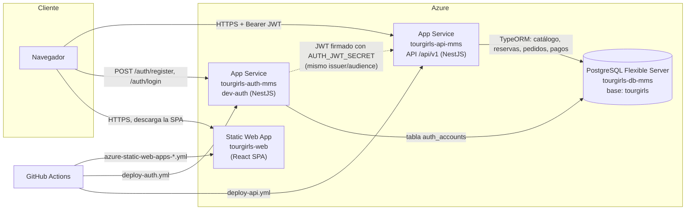
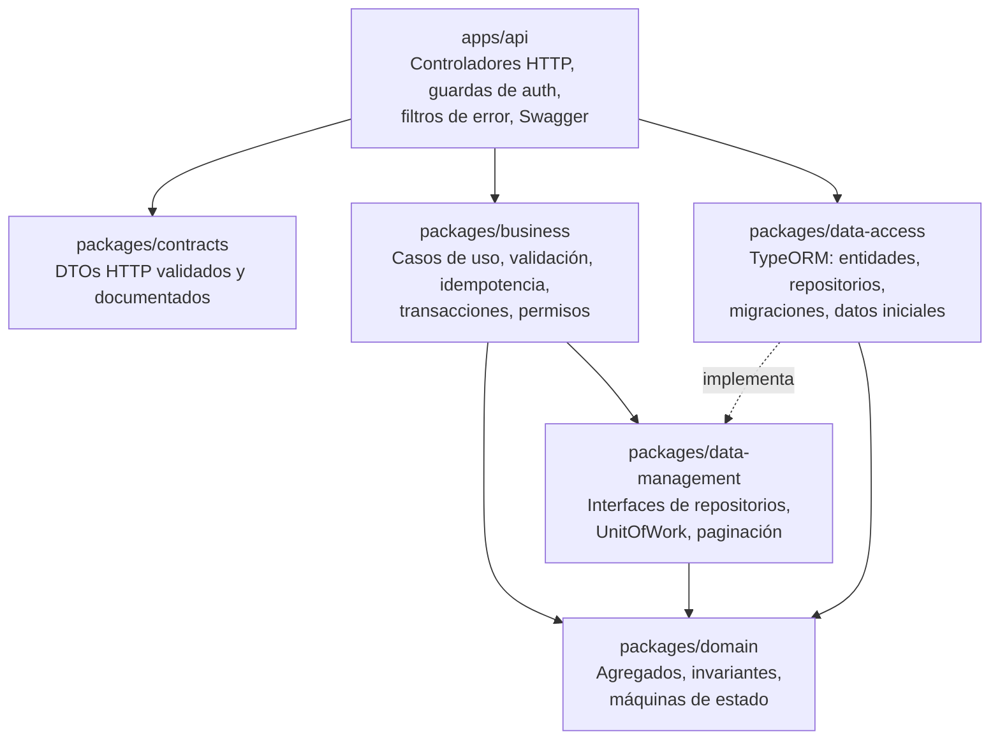
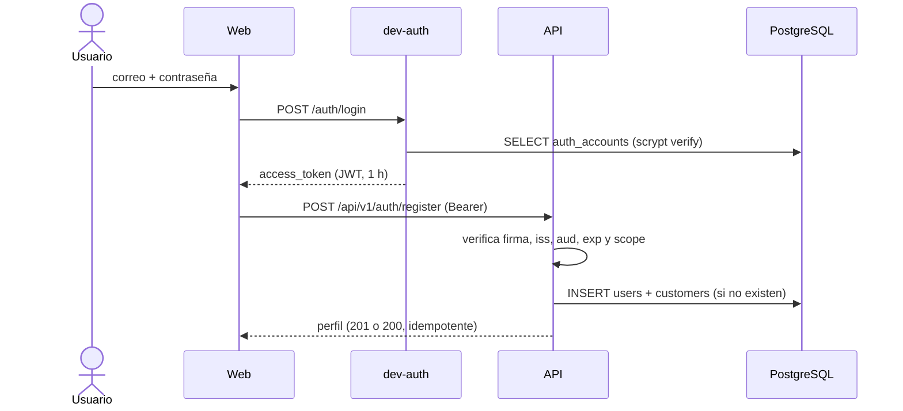
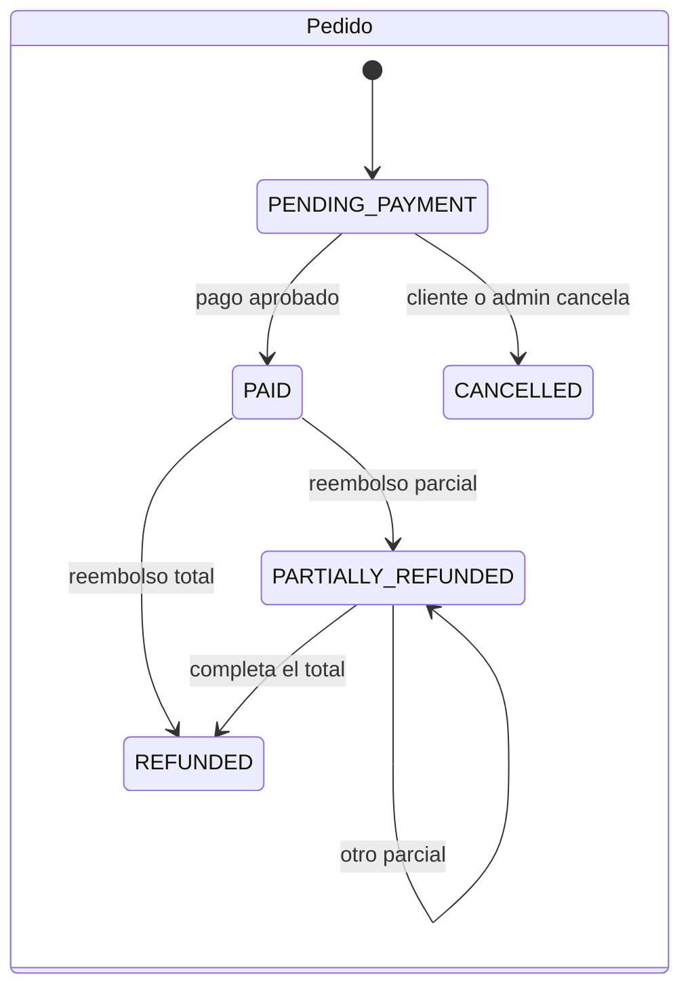
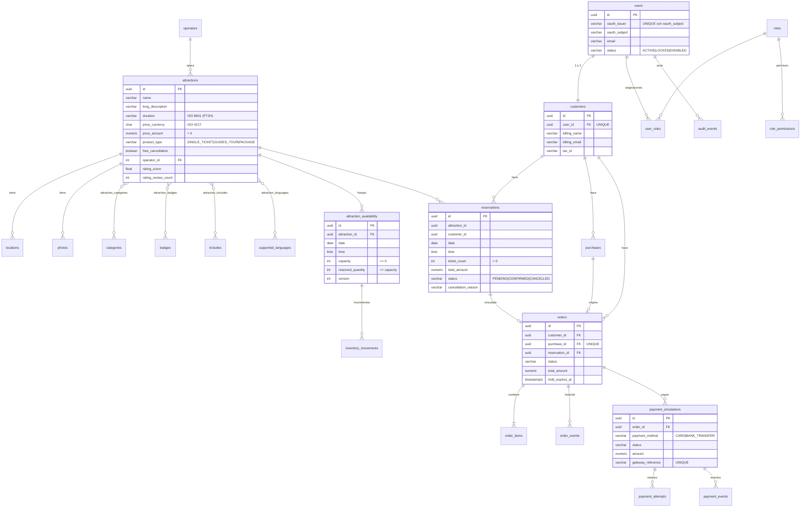

# Arquitectura técnica · TourGirls

Documento técnico de referencia del sistema tal como está implementado y desplegado. Cubre la arquitectura de
componentes, las capas del backend, los flujos principales, el modelo de datos, el resumen de APIs y la seguridad.

Documentos relacionados:
- [INTEROPERABILIDAD.md](INTEROPERABILIDAD.md): endpoints y reglas para integrar otros sistemas.
- [EVENTOS.md](EVENTOS.md): diseño de eventos para integración asíncrona (SOA/EDA).
- [DESPLIEGUE_AZURE.md](DESPLIEGUE_AZURE.md): guía de despliegue.

> **Nota sobre documentos anteriores.** Los archivos `PLAN_IMPLEMENTACION_*.md` describen el diseño original en .NET
> (Entity Framework, `AtraccionesService.API`, etc.). La implementación actual es **NestJS + TypeORM + PostgreSQL**.
> Las reglas de negocio de esos planes se conservaron, pero los nombres de proyectos y tecnologías ya no aplican.
> Ante cualquier diferencia, manda este documento.

---

## 1. Visión general

TourGirls es un marketplace de atracciones turísticas de Ecuador (tours, entradas y paquetes). Permite:

- **Visitantes y clientes:** buscar atracciones, consultar la disponibilidad por franja, reservar, comprar con pago
  simulado y gestionar sus reservas y pedidos.
- **Administradores:** publicar y mantener el catálogo, gestionar la disponibilidad, consultar reservas, pedidos y
  pagos, cancelar y reembolsar pedidos, gestionar clientes y roles, y ver reportes de ventas.

| Componente | Tecnología | Carpeta | Despliegue (Azure) |
|---|---|---|---|
| Web (marketplace + panel admin) | React 19, TypeScript, Vite, Tailwind, Zustand, zod | `AtraccionesService-web/` | Static Web Apps |
| API de atracciones | NestJS 11, TypeORM 0.3, class-validator, Swagger | `apps/api/` | App Service Linux (Node) |
| Servicio de autenticación (dev-auth) | NestJS 11, pg, jose (JWT HS256), scrypt | `apps/auth/` | App Service (mismo plan) |
| Base de datos | PostgreSQL | migraciones en `packages/data-access/` | Azure Database for PostgreSQL – Flexible Server |
| CI/CD | GitHub Actions | `.github/workflows/` | Despliegue en cada push a `main` |

---

## 2. Diagrama de componentes



**Relación entre los servicios:**
- **dev-auth** autentica (correo y contraseña) y emite un **JWT HS256** con `iss=tourgirls-auth`, `aud=tourgirls-api` y
  los `scope` del usuario.
- **El API** no llama a dev-auth: verifica la firma, el emisor, la audiencia y la expiración del token por su cuenta,
  usando el secreto compartido. Así los dos servicios quedan desacoplados y dev-auth se puede sustituir por un
  proveedor OAuth2/OIDC estándar (Entra ID, Auth0, Keycloak) cambiando solo la verificación del token.
- **Base de datos:** ambos servicios usan la misma base, pero en **tablas separadas**. El API nunca lee
  `auth_accounts` ni dev-auth lee las tablas del API.

**URLs públicas:**

| Servicio | URL |
|---|---|
| Web | https://red-pebble-08e84d70f.1.azurestaticapps.net |
| API | https://tourgirls-api-mms-hagtfccfdddceheu.westus2-01.azurewebsites.net/api/v1 |
| Swagger | https://tourgirls-api-mms-hagtfccfdddceheu.westus2-01.azurewebsites.net/docs |
| OpenAPI JSON | https://tourgirls-api-mms-hagtfccfdddceheu.westus2-01.azurewebsites.net/openapi/v1.json |
| Autenticación | https://tourgirls-auth-mms-akcxfugse5c6g6bd.westus2-01.azurewebsites.net |

---

## 3. Backend: monorepo por capas

El backend es un monorepo con **npm workspaces**. Cada capa es un paquete TypeScript con dependencias en una sola
dirección:



| Paquete | Responsabilidad | No debe |
|---|---|---|
| `domain` | Modelo de dominio: `Attraction`, `AvailabilitySlot`, `Reservation`, `Order`, `PaymentSimulation`, `User`, `Customer`, `Money`, y sus transiciones de estado válidas | Depender de HTTP, ORM o base de datos |
| `data-management` | Contratos de persistencia: repositorios, `UnitOfWork`, `PagedResult`, errores de concurrencia | Contener implementación |
| `business` | Casos de uso: catálogo, disponibilidad, reservas, compra, pedidos, pagos, identidad, administración; validaciones, idempotencia, reloj de negocio (America/Guayaquil) | Conocer HTTP o TypeORM |
| `data-access` | Implementación PostgreSQL con TypeORM, migraciones versionadas, carga del catálogo inicial | Contener reglas de negocio |
| `contracts` | DTOs de entrada y salida con `class-validator` y `@nestjs/swagger` | Contener lógica |
| `apps/api` | Composición (composition root), rutas `/api/v1`, autenticación JWT, scopes, permisos locales, rate limit, errores RFC 7807, Swagger | Acceder a la base de datos saltándose `business` |
| `apps/auth` | Registro e inicio de sesión, hash scrypt, bloqueo tras intentos fallidos, emisión del JWT | Conocer el dominio de atracciones |

**Mecanismos transversales:**

| Mecanismo | Implementación |
|---|---|
| Transacciones | `UnitOfWorkFactory.transaction()` envuelve cada caso de uso de escritura; los errores 23505/40001 de PostgreSQL se traducen a `ConcurrencyError` (409) |
| Idempotencia | Cabecera `Idempotency-Key` (UUID) en todas las mutaciones. Tabla `idempotency_keys` con identidad `issuer + subject + operación + clave`, hash canónico del payload y respuesta guardada para devolverla igual al repetir. Retención: 24 h |
| Sin sobreventa | `UPDATE attraction_availability SET reserved_quantity = reserved_quantity + n WHERE id = ? AND reserved_quantity + n <= capacity` (condicional y atómico) |
| Errores | RFC 7807 `application/problem+json` con `type`, `title`, `status`, `detail`, `code` estable y `traceId` |
| Rate limit | 100 solicitudes por minuto, por usuario (`sub`) o por IP si no hay token |
| Paginación | `limit`/`offset` con metadatos; la búsqueda usa además `nextPage`, un token firmado con HMAC y ligado a los criterios |
| Precios | Siempre calculados en el servidor con una copia del precio al crear el pedido; los importes enviados por el cliente no se usan |
| Auditoría | `audit_events` registra cada cambio administrativo con actor, acción, recurso y motivo |

---

## 4. Frontend

```
AtraccionesService-web/src/
  api/          clientes HTTP por recurso (client.ts: token, errores RFC 7807, Idempotency-Key)
  app/          router (carga diferida por página), layout y rutas
  components/   common, layout, attractions, search, reservation, purchase, profile
  features/     auth (sesión en memoria, rutas protegidas), attractions (filtros, catálogo demo/API)
  hooks/        useAuth, useAsync, useIdempotentMutation, usePagination…
  pages/        marketplace (Home, Attractions, Search, Detail, Reservation, Purchase, Order, Profile…)
                admin/ (Dashboard, Catálogo, Disponibilidad, Reservas, Pedidos, Pagos, Clientes, Usuarios, Reportes)
  stores/       Zustand: autenticación, compra, UI, favoritos
  utils/        formatos, fechas, validación (zod), errores
```

- **Sesión:** el token se guarda **solo en memoria**, nunca en `localStorage`. Al recargar la pestaña hay que volver a
  iniciar sesión.
- **Catálogo:** la lectura es pública en el API, así que la web muestra los datos de PostgreSQL con o sin sesión. El
  catálogo de demostración (`demoCatalog.ts`) solo se usa con `VITE_CATALOG_SOURCE=demo`, para trabajar sin backend.
- **Mutaciones:** cada intento lógico genera una `Idempotency-Key`. Los reintentos por errores de red reutilizan la
  misma clave.
- **Configuración de compilación:** `VITE_API_URL` y `VITE_AUTH_URL`.

---

## 5. Flujos principales

### 5.1 Inicio de sesión y aprovisionamiento del perfil



### 5.2 Compra directa y pago simulado

```mermaid
sequenceDiagram
  actor C as Cliente
  participant W as Web
  participant API as API
  participant DB as PostgreSQL

  C->>W: elige fecha, franja y entradas
  W->>API: POST /attractions/{id}/purchase + Idempotency-Key
  API->>DB: UPDATE condicional de cupos (retención)
  API->>DB: INSERT reservations (PENDING), purchases, orders (PENDING_PAYMENT, hold 15 min), order_items, inventory_movements, order_events
  API-->>W: 201 pedido pendiente
  C->>W: paga (tarjeta o transferencia)
  W->>API: POST /payments/simulations + Idempotency-Key
  API->>DB: INSERT payment_simulations, payment_attempts, payment_events
  alt aprobado
    API->>DB: orders → PAID, reservations → CONFIRMED, order_events
  else rechazado (.51) o fallido (.52)
    API->>DB: pago REJECTED/FAILED; pedido sigue PENDING_PAYMENT (máx. 3 intentos)
  end
  API-->>W: resultado del pago
```

### 5.3 Cancelación y reembolso (administración)

- **Pedido `PENDING_PAYMENT`.** `POST /admin/orders/{id}/cancel` pasa el pedido a `CANCELLED`, libera los cupos,
  cancela la reserva y registra `order_events` y `audit_events`.
- **Pedido `PAID` o `PARTIALLY_REFUNDED`.** `POST /admin/orders/{id}/refunds` registra un reembolso parcial o total,
  sin superar lo cobrado. El reembolso total pasa pedido y pago a `REFUNDED`, cancela la reserva y libera los cupos.

### 5.4 Estados



| Agregado | Estados |
|---|---|
| Reserva | `PENDING` → `CONFIRMED` → `CANCELLED` (también `PENDING` → `CANCELLED`). La reserva directa nace `CONFIRMED` |
| Pago simulado | `PENDING` → `AUTHORIZED` → `SETTLED` → `PARTIALLY_REFUNDED` / `REFUNDED`; o `PENDING` → `REJECTED` / `FAILED` |
| Usuario | `ACTIVE`, `LOCKED`, `DISABLED`. Solo un usuario `ACTIVE` puede operar |

---

## 6. Modelo de datos

La fuente de verdad son las migraciones de `packages/data-access/src/migrations`, que se aplican solas al arrancar el
API:
- `InitialSchema`: 29 tablas.
- `AdminRole`: rol `admin` con los permisos `catalog:write` y `admin:manage`.

dev-auth crea su propia tabla `auth_accounts`.

### 6.1 Diagrama entidad-relación



### 6.2 Tablas por área

| Área | Tablas | Notas |
|---|---|---|
| Catálogo | `attractions`, `operators`, `locations`, `photos`, `categories`, `badges`, `includes`, `supported_languages` y 4 tablas puente | Catálogos de valores normalizados; borrar una atracción borra en cascada sus ubicaciones, fotos y franjas |
| Disponibilidad | `attraction_availability` | Única por `(attraction_id, date, time)`; `CHECK reserved_quantity <= capacity`. Se mantienen franjas 09:00 y 14:00 de capacidad 20 durante los próximos 60 días |
| Reservas | `reservations` | Índices por cliente y fecha, estado, correo y atracción |
| Identidad | `users`, `customers`, `roles`, `role_permissions`, `user_roles` | Identidad única `oauth_issuer + oauth_subject`; las revocaciones de rol conservan el registro (`revoked_at`) |
| Ecommerce | `purchases`, `orders`, `order_items`, `order_events`, `payment_simulations`, `payment_attempts`, `payment_events`, `inventory_movements` | Los eventos e intentos son de solo inserción; `payment_events.payload` es `jsonb` |
| Infraestructura | `idempotency_keys`, `audit_events` | `idempotency_keys` única por `(issuer, subject, operation, key)` |
| Autenticación (dev-auth) | `auth_accounts` | Correo único sin distinguir mayúsculas, hash scrypt, `failed_attempts` y `locked_until` |

**Integridad garantizada por la base de datos:**
- claves foráneas con `RESTRICT` en datos transaccionales y `CASCADE` en los hijos del catálogo;
- `CHECK` de estados, cantidades e importes positivos;
- unicidades de negocio;
- aislamiento transaccional por caso de uso.

---

## 7. Resumen de APIs

Prefijo `/api/v1`. La documentación interactiva completa está en `/docs` y el contrato en `/openapi/v1.json`
(OpenAPI 3.0, 35 rutas).

| Grupo | Endpoints | Scope / permiso |
|---|---|---|
| Catálogo (lectura) | `POST /atracciones/search`, `POST /atracciones/details`, `GET /atracciones`, `GET /atracciones/{id}`, `GET /atracciones/{id}/availability` | Público (sin token) |
| Catálogo (escritura) | `POST /atracciones`, `PUT/PATCH/DELETE /atracciones/{id}` | `attractions:write` + `catalog:write` |
| Reservas | `POST /atracciones/{id}/reservations`, `GET /atracciones/reservations[/{id}]`, `POST /atracciones/reservations/{id}/cancel` | `book` / `read` / `cancel` |
| Identidad y cliente | `POST /auth/register`, `GET /users/me`, `GET/PUT /customers/me`, `GET /customers/me/reservations` | `read` / `book` |
| Compra y pedidos | `POST /attractions/{id}/purchase`, `POST /orders`, `GET /orders/{id}`, `GET /orders/{id}/events`, `POST /orders/{id}/cancel` | `book` / `read` / `cancel` |
| Pagos | `POST /payments/simulations` | `attractions:book` |
| Administración | `GET /admin/summary`, `/admin/customers[/{id}[/status\|/roles]]`, `/admin/roles`, `/admin/reservations`, `/admin/orders[/{id}[/cancel\|/refunds]]`, `/admin/payments`, `/admin/availability[/{id}]`, `/admin/reports/sales` | `attractions:write` + `admin:manage` |
| Salud | `GET /health` | Público |

**dev-auth** (fuera de `/api/v1`):
- `POST /auth/register` (nombre, correo, contraseña) y `POST /auth/login` devuelven `{ access_token, token_type, expires_in, scope }`;
- `GET /health`.

---

## 8. Seguridad

| Aspecto | Medida |
|---|---|
| Autenticación | JWT HS256 de 1 h. El API verifica firma, `iss`, `aud`, `exp` (tolerancia de 60 s) y que existan `sub` y `exp` |
| Autorización (1) | Scopes del token por operación: `attractions:read`, `attractions:book`, `attractions:cancel`, `attractions:write` |
| Autorización (2) | Permisos locales en la base de datos (`catalog:write`, `admin:manage`) asignados por rol; un usuario no `ACTIVE` no tiene permisos |
| Propiedad de los datos | Reservas y pedidos se buscan siempre por el cliente del token; los identificadores enviados por el cliente nunca determinan el dueño |
| Contraseñas | scrypt con sal; bloqueo de 10 min tras 5 intentos fallidos (429 `ACCOUNT_LOCKED`) |
| Datos de pago | Solo se simula. No se guardan números de tarjeta y las referencias de pago no pueden ser solo dígitos |
| Transporte y CORS | HTTPS en Azure; CORS limitado a los orígenes configurados (`CORS_ORIGINS`) |
| Abuso | Rate limit por usuario o IP; límites de tamaño del cuerpo (256 KB en el API, 16 KB en dev-auth) |
| Secretos | Solo en las variables de App Service y en archivos `.env` locales ignorados por git; nunca en el repositorio |

---

## 9. Despliegue y operación

| Etapa | Detalle |
|---|---|
| Compilación del backend | GitHub Actions (`ubuntu-latest`, Node 22): `npm ci`, `npm run build` y `node tools/package-backend.mjs`, que incrusta los paquetes `@atracciones/*` con esbuild y genera `out/backend` con dependencias de producción |
| Publicación | `azure/webapps-deploy` con el perfil de publicación (secretos `AZURE_API_PUBLISH_PROFILE`, `AZURE_AUTH_PUBLISH_PROFILE`) |
| Arranque del API | Aplica las migraciones pendientes, carga el catálogo inicial si está vacío y completa las franjas de los próximos días |
| Web | Static Web Apps compila `AtraccionesService-web` con `VITE_API_URL`/`VITE_AUTH_URL` y sirve `dist`, con fallback a `index.html` |
| Local | `start-local.cmd` arranca PostgreSQL embebido (5433), dev-auth (5280), API (5276) y web (5173) |
| Pruebas | `npm test`: 51 pruebas unitarias y e2e contra PostgreSQL embebido; frontend con Vitest (42 pruebas) |
