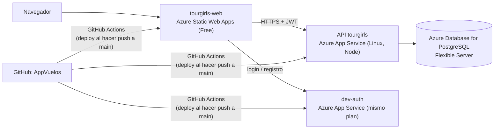

# DESPLIEGUE_AZURE — Subir EcoAirlines a Azure paso a paso

Guía para publicar los 4 componentes en Azure: la **web**, la **API**, la **base de datos PostgreSQL** y **dev-auth**. Hay pasos que
haces tú en el portal de Azure y cambios de código que hago yo antes de desplegar.

---

## 1. Qué servicio de Azure usa cada parte



| Parte | Servicio de Azure | Plan recomendado | Por qué |
|-------|-------------------|------------------|---------|
| Web (React + Vite) | **Azure Static Web Apps** | Free | Son archivos estáticos (HTML, JS, CSS): no necesitan servidor. Incluye HTTPS y CDN |
| API (NestJS) | **Azure App Service** (Web App, Linux, Node) | **B1** (Basic) | Proceso Node siempre encendido. El plan F1 gratis "duerme" la app y limita a 60 min de CPU al día |
| dev-auth (Node) | **Azure App Service**, en el **mismo plan** que la API | Comparte el B1 | Un plan puede tener varias apps sin costo extra |
| Base de datos | **Azure Database for PostgreSQL – Flexible Server** | Burstable **B1ms**, 32 GB | PostgreSQL administrado: copias de seguridad, SSL, sin instalar nada |

**Costo aproximado** (Azure for Students da **US$100 de crédito** sin tarjeta):

| Servicio | Costo |
|----------|-------|
| App Service B1 | ~US$13/mes (cubre la API y dev-auth) |
| PostgreSQL B1ms | ~US$13–16/mes. Con cuenta gratuita, 750 h/mes gratis durante 12 meses |
| Static Web Apps Free | US$0 |

> **Ahorro:** el servidor de PostgreSQL se puede **detener** cuando no lo uses (hasta 7 días seguidos) y el plan B1 se puede bajar a F1
> después de la evaluación.

---

## 2. Qué falta en el código antes de desplegar (🤖 lo hago yo)

| # | Cambio | Por qué es necesario |
|---|--------|----------------------|
| 1 | **PostgreSQL** (criterio 5): repositorios con TypeORM detrás de las interfaces actuales; tablas para reservas, holds, perfiles, rutas, flota, webhooks, etc. Variable `DATABASE_URL` | Sin base de datos, cada reinicio de Azure borra todo |
| 2 | **Swagger en la nube** (NUBE-01): `PUBLIC_API_URL` para que "Try it out" use la URL pública, y que **Authorize** funcione con token en producción | Los evaluadores probarán desde Swagger |
| 3 | **dev-auth en la nube** (NUBE-03): permitir arrancarlo en Azure con un secreto real y orígenes CORS públicos, y poder cambiar las contraseñas de prueba por variables | Hoy se niega a arrancar con `NODE_ENV=production` |
| 4 | **`staticwebapp.config.json`** en la web | Para que rutas como `/admin` o `/mis-viajes` no den 404 al recargar (fallback a `index.html`) |
| 5 | **Workflows de GitHub Actions** para la API (monorepo con 4 capas) y para dev-auth | El asistente de Azure no sabe compilar un monorepo con workspaces |

Cuando estén listos te aviso. Mientras tanto puedes avanzar con la sección 3, que no depende del código.

---

## 3. Paso a paso en el portal de Azure (🧑 lo haces tú)

### Paso 0 — Cuenta

1. Entra a **https://azure.microsoft.com/es-es/free/students** con tu correo institucional. Azure for Students no pide tarjeta. Si no
   te deja, usa la cuenta gratuita normal (pide tarjeta, pero no cobra si no pasas el crédito).
2. Entra al portal: **https://portal.azure.com**.
3. Arriba, en el buscador, escribe **"Suscripciones"** y anota el nombre de la tuya (por ejemplo, "Azure for Students").

> **Región:** Azure for Students solo permite **algunas regiones** (varía por cuenta). Si aparece "La suscripción "Azure for Students"
> no se puede aprovisionar en …", esa región no está permitida.
> - **Para ver la lista:** buscador → **Directiva** (Azure Policy) → **Asignaciones** → la asignación de **regiones permitidas** →
>   parámetros.
> - Si no la encuentras, prueba otras (East US, Central US, West US 2/3, South Central US, Brazil South) hasta que desaparezca el error
>   rojo.
> - Usa **la misma región permitida para todos los recursos**. El grupo de recursos puede estar en otra: no importa.

### Paso 1 — Grupo de recursos

Un grupo de recursos es una "carpeta" que agrupa todo el proyecto. Borrarlo borra todo de una vez.

1. Buscador → **Grupos de recursos** → **+ Crear**.
2. Suscripción: la tuya · Nombre: **`rg-tourgirls`** · Región: **East US 2**.
3. **Revisar y crear** → **Crear**.

### Paso 2 — Base de datos PostgreSQL

1. Buscador → **Azure Database for PostgreSQL flexible servers** → **+ Crear**.

> ⚠️ **Cuidado con el costo.** El formulario viene en **"Producción"** con un servidor **D4ds_v4 (~USD 275/mes)**. Hay que cambiarlo
> a **Desarrollo/pruebas** y, en **Configurar servidor**, a **Burstable → Standard_B1ms, 32 GiB**. El total estimado debe quedar en
> **~USD 15–20/mes**: si ves más, **no lo crees**. Elige primero la **región** (si no es válida, los demás campos quedan
> deshabilitados) y revisa el tamaño después de cambiarla.

2. Pestaña **Básico**:

   | Campo | Valor |
   |-------|-------|
   | Grupo de recursos | `rg-tourgirls` |
   | Nombre del servidor | `tourgirls-db-<tus-iniciales>` (único en todo Azure, p. ej. `tourgirls-db-ga`) |
   | Región | la misma (East US 2) |
   | Versión de PostgreSQL | **16** |
   | Tipo de carga de trabajo | **Desarrollo** |
   | Proceso y almacenamiento | **Configurar servidor** → **Flexible (Burstable)** → **Standard_B1ms**, almacenamiento **32 GiB**, sin alta disponibilidad |
   | Método de autenticación | **Solo autenticación de PostgreSQL** |
   | Usuario administrador | `touradmin` |
   | Contraseña | una segura. **Guárdala**: la necesitarás. No la escribas en el código ni en el repositorio |

3. Pestaña **Redes**:
   - Método de conectividad: **Acceso público (direcciones IP permitidas)**.
   - Marca **"Permitir el acceso público desde cualquier servicio de Azure en Azure a este servidor"**, para que la API pueda conectarse.
   - **+ Agregar dirección IP del cliente actual**, para conectarte desde tu PC con pgAdmin o DBeaver.
4. **Revisar y crear** → **Crear**. Tarda unos 5–10 minutos.
5. Cuando termine: entra al servidor → **Bases de datos** → **+ Agregar** → nombre **`tourgirls`** → Guardar.
6. Anota el **nombre del servidor** (aparece en "Información general" como `tourgirls-db-ga.postgres.database.azure.com`).

### Paso 3 — Plan de App Service y las dos apps (API y dev-auth)

1. Buscador → **App Services** → **+ Crear** → **Aplicación web**.
2. Pestaña **Básico** (para la **API**):

   | Campo | Valor |
   |-------|-------|
   | Grupo de recursos | `rg-tourgirls` |
   | Nombre | `tourgirls-api-<iniciales>` → su URL será `https://tourgirls-api-ga.azurewebsites.net` (si Azure agrega un sufijo al nombre, anota la URL exacta que muestre) |
   | Publicar | **Código** |
   | Pila del entorno de ejecución | **Node 24 LTS** (si no aparece, **Node 22 LTS**) |
   | Sistema operativo | **Linux** |
   | Región | la misma |
   | Plan de Linux | **Crear nuevo** → `asp-tourgirls` |
   | Plan de precios | **Basic B1** |

3. Pestaña **Implementación**: deja la implementación continua **deshabilitada** por ahora; la conectamos con el workflow que voy a
   preparar.
4. **Revisar y crear** → **Crear**.
5. Repite para **dev-auth**:
   - Nombre: `tourgirls-auth-<iniciales>`.
   - Misma pila (Node), Linux y región.
   - En el plan elige el **mismo `asp-tourgirls`**. No crees otro: así no pagas dos veces.

### Paso 4 — Static Web App (la web)

1. Buscador → **Static Web Apps** → **+ Crear**.
2. Completa el formulario:

   | Campo | Valor |
   |-------|-------|
   | Grupo de recursos | `rg-tourgirls` |
   | Nombre | `tourgirls-web` |
   | Tipo de plan | **Free** |
   | Origen de la implementación | **GitHub** → autoriza tu cuenta → organización `gab5453`, repositorio **`AppVuelos`**, rama **`main`** |
   | Valores preestablecidos de compilación | **React** (o "Custom") |
   | Ubicación de la aplicación | **`/tourgirls-web`** |
   | Ubicación de la salida | **`dist`** |

3. **Revisar y crear** → **Crear**. Azure crea solo un workflow en tu repositorio
   (`.github/workflows/azure-static-web-apps-....yml`) y hace el primer despliegue.
4. Entra al recurso y anota su **URL** (algo como `https://<nombre-aleatorio>.azurestaticapps.net`).

> El primer despliegue funcionará, pero la web apuntará a `localhost`. Las URLs de la API y de dev-auth se fijan **al compilar**
> (`VITE_API_URL` y `VITE_AUTH_URL`). Yo las agrego a ese workflow cuando me pases las URLs.

### Paso 5 — Generar el secreto compartido de los tokens

La API y dev-auth deben compartir el mismo secreto para firmar y verificar los JWT. Genéralo en tu PC:

```powershell
node -e "console.log(require('crypto').randomBytes(48).toString('base64url'))"
```

Guárdalo: va **solo** en la configuración de Azure (paso 6), nunca en el repositorio.

### Paso 6 — Variables de entorno de cada app

En cada App Service: **Configuración** → **Variables de entorno** → pestaña **Configuración de la aplicación** → **+ Agregar** →
**Aplicar**.

**API (`tourgirls-api-ga`):**

| Nombre | Valor |
|--------|-------|
| `NODE_ENV` | `production` |
| `AUTH_JWT_SECRET` | el secreto del paso 5 |
| `AUTH_ISSUER` | `tourgirls-auth` |
| `AUTH_AUDIENCE` | `tourgirls-api` |
| `CORS_ORIGINS` | la URL de la Static Web App (p. ej. `https://xxx.azurestaticapps.net`), sin `/` al final |
| `TRUST_PROXY` | `1` (App Service está detrás de un balanceador; sin esto, el rate limit vería a todos como la misma IP) |
| `SWAGGER_ENABLED` | `true` |
| `PUBLIC_API_URL` | `https://tourgirls-api-ga.azurewebsites.net` *(lo usa el cambio 🤖 2)* |
| `DEV_AUTH_URL` | `https://tourgirls-auth-ga.azurewebsites.net` |
| `DATABASE_URL` | la cadena del paso 2 *(lo usa el cambio 🤖 1)* |
| `WEBHOOK_DELIVERY` | `http` |
| `SCM_DO_BUILD_DURING_DEPLOYMENT` | `true` |

Además: **Configuración** → **Configuración general** → **Comando de inicio**: `node TourGirls.API/dist/main.js`. Y activa
**Siempre activo (Always On)**, disponible en B1.

**dev-auth (`tourgirls-auth-ga`):**

| Nombre | Valor |
|--------|-------|
| `AUTH_JWT_SECRET` | **el mismo** secreto del paso 5 |
| `AUTH_ISSUER` | `tourgirls-auth` |
| `AUTH_AUDIENCE` | `tourgirls-api` |
| `CORS_ORIGINS` | `https://xxx.azurestaticapps.net,https://tourgirls-api-ga.azurewebsites.net` (la web y el Swagger de la API) |

Comando de inicio: `node server.mjs`.

> **No hace falta definir `PORT`:** App Service lo define solo y la API y dev-auth ya lo leen.

### Paso 7 — Pásame estos datos

Para terminar los workflows y la configuración necesito:

- [ ] URL de la Static Web App.
- [ ] Nombre exacto de la app de la API y de la de dev-auth.
- [ ] Nombre del servidor PostgreSQL. **La contraseña no**: va solo en Azure.
- [ ] Confirmar que pusiste las variables del paso 6.

---

## 4. Despliegue (🤖 + 🧑)

1. 🤖 Subo a `main`:
   - los cambios de la sección 2;
   - los workflows `.github/workflows/deploy-api.yml` y `deploy-auth.yml`;
   - las variables `VITE_*` en el workflow de la Static Web App.
2. 🧑 Para que GitHub pueda desplegar en cada App Service:
   - en el portal, entra a la app → **Información general** → **Descargar perfil de publicación**;
   - en GitHub: **AppVuelos** → **Settings** → **Secrets and variables** → **Actions** → **New repository secret**;
   - nombres: `AZURE_API_PUBLISH_PROFILE` y `AZURE_AUTH_PUBLISH_PROFILE`; valor: el contenido completo del archivo descargado.
   - Si el botón de descarga aparece deshabilitado: en la app → **Configuración** → **Configuración general** → activar **Autenticación
     básica de publicación SCM** → Guardar, y volver a descargar.
3. Cada `push` a `main` despliega solo. El avance se ve en GitHub → pestaña **Actions**.

---

## 5. Verificación final

| Qué | Cómo | Esperado |
|-----|------|----------|
| API viva | `https://tourgirls-api-ga.azurewebsites.net/docs` | Swagger con los 3 documentos |
| dev-auth vivo | `https://tourgirls-auth-ga.azurewebsites.net/health` | `{"status":"ok"}` |
| Web | URL de la Static Web App | Inicio de TourGirls; recargar en `/admin` no da 404 |
| Login | Iniciar sesión con un cliente de prueba | Entra y muestra "Hola, …" |
| Compra completa | Buscar → reservar → pagar con referencia de prueba | Reserva `CONFIRMED` |
| Persistencia | Reiniciar la API (App Service → **Reiniciar**) y volver a "Mis viajes" | La reserva sigue ahí |
| Admin | `admin@…` → panel, rutas, flota, observabilidad | Datos reales |
| Logs | App Service → **Supervisión** → **Secuencia de registro** | Ver arranque y errores |

---

## 6. Problemas frecuentes

| Síntoma | Causa probable | Solución |
|---------|----------------|----------|
| La API no arranca y el log lista errores de configuración | Falta `AUTH_JWT_SECRET`, `AUTH_ISSUER` o `AUTH_AUDIENCE`, o el secreto tiene menos de 32 caracteres | Revisar el paso 6 (la API valida todo al arrancar a propósito) |
| La web muestra "No se pudo conectar con el servidor" | `VITE_API_URL` mal puesto al compilar, o `CORS_ORIGINS` sin la URL exacta de la web | Revisar el workflow de la Static Web App y `CORS_ORIGINS` (sin `/` al final) |
| Login responde 401 en la API después de iniciar sesión | La API y dev-auth tienen distinto `AUTH_JWT_SECRET`, `AUTH_ISSUER` o `AUTH_AUDIENCE` | Deben ser idénticos en ambas apps |
| Error de conexión a PostgreSQL | Falta permitir los servicios de Azure en "Redes", o falta `sslmode=require` | Paso 2.3 y la cadena de conexión |
| Recargar `/admin` da 404 | Falta `staticwebapp.config.json` | Cambio 🤖 4 |
| La primera petición tarda ~20 s | La app estaba dormida (sin Always On, o en plan F1) | Activar Always On en B1 |
