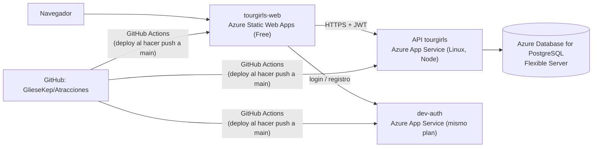

# DESPLIEGUE_AZURE — Subir TourGirls a Azure paso a paso

Guía para publicar los 4 componentes en Azure: la **web**, la **API**, la **base de datos PostgreSQL** y **dev-auth**. Hay pasos que
haces tú en el portal de Azure y cambios de código que hago yo antes de desplegar.

---

## 1. Qué servicio de Azure usa cada parte



| Parte | Servicio de Azure | Plan recomendado | Por qué |
|-------|-------------------|------------------|---------|
| Web (React + Vite) | **Azure Static Web Apps** | Free | Son archivos estáticos (HTML, JS, CSS): no necesitan servidor. Incluye HTTPS y CDN |
| API (NestJS) | **Azure App Service** (Web App, Linux, Node) | **B1** (Basic) | Proceso Node siempre encendido. El plan F1 gratis "duerme" la app y limita a 60 min de CPU al día |
| dev-auth (Node) | **Azure App Service**, en el **mismo plan** que la API | Comparte el B1 | Un plan puede tener varias apps sin costo extra |
| Base de datos | **Azure Database for PostgreSQL – Flexible Server** | Burstable **B1ms**, 32 GB | PostgreSQL administrado: copias de seguridad, SSL, sin instalar nada |

**Costo aproximado** (Azure for Students da **US$100 de crédito** sin tarjeta):

| Servicio | Costo |
|----------|-------|
| App Service B1 | ~US$13/mes (cubre la API y dev-auth) |
| PostgreSQL B1ms | ~US$13–16/mes. Con cuenta gratuita, 750 h/mes gratis durante 12 meses |
| Static Web Apps Free | US$0 |

> **Ahorro:** el servidor de PostgreSQL se puede **detener** cuando no lo uses (hasta 7 días seguidos) y el plan B1 se puede bajar a F1
> después de la evaluación.

---

## 2. Estado del código para el despliegue

| # | Componente | Estado del proyecto y configuración necesaria |
|---|--------|----------------------|
| 1 | **PostgreSQL**: ya están implementados los repositorios TypeORM, las entidades y las migraciones. La API aplica migraciones y puede cargar el catálogo inicial al arrancar. | En Azure se configura `DATABASE_URL` y `DATABASE_SSL=true`; ambos servicios usan PostgreSQL. |
| 2 | **Swagger en la nube**: el API ya acepta `PUBLIC_API_URL` y configura autenticación Bearer para **Authorize**. | Configurar `PUBLIC_API_URL` con la URL real del App Service de la API. |
| 3 | **Autenticación en la nube**: `apps/auth` ya lee el secreto JWT, PostgreSQL y CORS desde variables de entorno; las cuentas y contraseñas se gestionan en la base de datos. | Configurar las mismas variables JWT en API y auth. No hay contraseñas de prueba que deban convertirse en variables. |
| 4 | **Rutas de la web**: `AtraccionesService-web/public/staticwebapp.config.json` ya configura el fallback a `index.html`. | La salida de Azure Static Web Apps debe ser `dist` dentro de `AtraccionesService-web`. |
| 5 | **Empaquetado del backend**: `tools/package-backend.ps1` crea `out/backend.zip` con el código y los manifiestos del monorepo, sin `node_modules` ni `dist`. | Los workflows de GitHub Actions para API y auth deben publicar ese ZIP en ambas Web Apps y activar la compilación remota de App Service (`SCM_DO_BUILD_DURING_DEPLOYMENT=true`). Azure instala las dependencias del monorepo y ejecuta `npm run build` desde la raíz. |

La estructura actual es un monorepo npm: API y auth viven en `apps/`, comparten paquetes de `packages/` y la web es un proyecto Vite independiente en `AtraccionesService-web/`.

---

## 3. Paso a paso en el portal de Azure (🧑 lo haces tú)

### Paso 0 — Cuenta

1. Entra a **https://azure.microsoft.com/es-es/free/students** con tu correo institucional. Azure for Students no pide tarjeta. Si no
   te deja, usa la cuenta gratuita normal (pide tarjeta, pero no cobra si no pasas el crédito).
2. Entra al portal: **https://portal.azure.com**.
3. Arriba, en el buscador, escribe **"Suscripciones"** y anota el nombre de la tuya (por ejemplo, "Azure for Students").

> **Región:** Azure for Students solo permite **algunas regiones** (varía por cuenta). Si aparece "La suscripción "Azure for Students"
> no se puede aprovisionar en …", esa región no está permitida.
> - **Para ver la lista:** buscador → **Directiva** (Azure Policy) → **Asignaciones** → la asignación de **regiones permitidas** →
>   parámetros.
> - Si no la encuentras, prueba otras (East US, Central US, West US 2/3, South Central US, Brazil South) hasta que desaparezca el error
>   rojo.
> - Usa **la misma región permitida para todos los recursos**. El grupo de recursos puede estar en otra: no importa.

### Paso 1 — Grupo de recursos

Un grupo de recursos es una "carpeta" que agrupa todo el proyecto. Borrarlo borra todo de una vez.

1. Buscador → **Grupos de recursos** → **+ Crear**.
2. Suscripción: la tuya · Nombre: **`rg-tourgirls`** · Región: **East US 2**.
3. **Revisar y crear** → **Crear**.

### Paso 2 — Base de datos PostgreSQL

1. Buscador → **Azure Database for PostgreSQL flexible servers** → **+ Crear**.

> ⚠️ **Cuidado con el costo.** El formulario viene en **"Producción"** con un servidor **D4ds_v4 (~USD 275/mes)**. Hay que cambiarlo
> a **Desarrollo/pruebas** y, en **Configurar servidor**, a **Burstable → Standard_B1ms, 32 GiB**. El total estimado debe quedar en
> **~USD 15–20/mes**: si ves más, **no lo crees**. Elige primero la **región** (si no es válida, los demás campos quedan
> deshabilitados) y revisa el tamaño después de cambiarla.

2. Pestaña **Básico**:

   | Campo | Valor |
   |-------|-------|
   | Grupo de recursos | `rg-tourgirls` |
   | Nombre del servidor | `tourgirls-db-<tus-iniciales>` (único en todo Azure, p. ej. `tourgirls-db-ga`) |
   | Región | la misma (East US 2) |
   | Versión de PostgreSQL | **16** |
   | Tipo de carga de trabajo | **Desarrollo** |
   | Proceso y almacenamiento | **Configurar servidor** → **Flexible (Burstable)** → **Standard_B1ms**, almacenamiento **32 GiB**, sin alta disponibilidad |
   | Método de autenticación | **Solo autenticación de PostgreSQL** |
   | Usuario administrador | `touradmin` |
   | Contraseña | una segura. **Guárdala**: la necesitarás. No la escribas en el código ni en el repositorio |

3. Pestaña **Redes**:
   - Método de conectividad: **Acceso público (direcciones IP permitidas)**.
   - Marca **"Permitir el acceso público desde cualquier servicio de Azure en Azure a este servidor"**, para que la API pueda conectarse.
   - **+ Agregar dirección IP del cliente actual**, para conectarte desde tu PC con pgAdmin o DBeaver.
4. **Revisar y crear** → **Crear**. Tarda unos 5–10 minutos.
5. Cuando termine: entra al servidor → **Bases de datos** → **+ Agregar** → nombre **`tourgirls`** → Guardar.
6. Anota el **nombre del servidor** (aparece en "Información general" como `tourgirls-db-mms.postgres.database.azure.com`).

### Paso 3 — Plan de App Service y las dos apps (API y dev-auth)

1. Buscador → **App Services** → **+ Crear** → **Aplicación web**.
2. Pestaña **Básico** (para la **API**):

   | Campo | Valor |
   |-------|-------|
   | Grupo de recursos | `rg-tourgirls` |
   | Nombre | `tourgirls-api-<iniciales>` → Azure agrega un sufijo único: anota el **Dominio predeterminado** exacto (en este proyecto, `https://tourgirls-api-mms-hagtfccfdddceheu.westus2-01.azurewebsites.net`) |
   | Publicar | **Código** |
   | Pila del entorno de ejecución | **Node 22 LTS** |
   | Sistema operativo | **Linux** |
   | Región | la misma |
   | Plan de Linux | **Crear nuevo** → `asp-tourgirls` |
   | Plan de precios | **Basic B1** |

3. Pestaña **Implementación**: deja la implementación continua **deshabilitada** por ahora; la conectamos con el workflow que voy a
   preparar.
4. **Revisar y crear** → **Crear**.
5. Repite para **dev-auth**:
   - Nombre: `tourgirls-auth-<iniciales>`.
   - Misma pila (Node), Linux y región.
   - En el plan elige el **mismo `asp-tourgirls`**. No crees otro: así no pagas dos veces.

### Paso 4 — Static Web App (la web)

1. Buscador → **Static Web Apps** → **+ Crear**.
2. Completa el formulario:

   | Campo | Valor |
   |-------|-------|
   | Grupo de recursos | `rg-tourgirls` |
   | Nombre | `tourgirls-web` |
   | Tipo de plan | **Free** |
   | Origen de la implementación | **GitHub** → autoriza tu cuenta → organización `GlieseKep`, repositorio **`Atracciones`**, rama **`main`** |
   | Valores preestablecidos de compilación | **React** (Vite) |
   | Ubicación de la aplicación | **`/AtraccionesService-web`** |
   | Ubicación de la salida | **`dist`** |

3. **Revisar y crear** → **Crear**. Azure crea solo un workflow en tu repositorio
   (`.github/workflows/azure-static-web-apps-....yml`) y hace el primer despliegue.
4. Entra al recurso y anota su **URL** (algo como `https://<nombre-aleatorio>.azurestaticapps.net`).

> La web lee `VITE_API_URL` y `VITE_AUTH_URL` al compilar. Configúralas como variables del workflow de Static Web Apps
> (no como variables de ejecución de Azure); `VITE_API_URL` debe ser el origen del API, sin `/api/v1`, porque el cliente agrega ese prefijo.

### Paso 5 — Generar el secreto compartido de los tokens

La API y dev-auth deben compartir el mismo secreto para firmar y verificar los JWT. Genéralo en tu PC:

```powershell
node -e "console.log(require('crypto').randomBytes(48).toString('base64url'))"
```

Guárdalo: va **solo** en la configuración de Azure (paso 6), nunca en el repositorio.

### Paso 6 — Variables de entorno de cada app

En cada App Service: **Configuración** → **Variables de entorno** → pestaña **Configuración de la aplicación** → **+ Agregar** →
**Aplicar**.

**API (`tourgirls-api-mms`):**

| Nombre | Valor |
|--------|-------|
| `DATABASE_URL` | `postgres://touradmin:<contraseña-codificada>@tourgirls-db-mms.postgres.database.azure.com:5432/tourgirls` |
| `DATABASE_SSL` | `true` |
| `DB_MIGRATIONS_RUN` | `true` (valor predeterminado; aplica las migraciones pendientes al iniciar) |
| `DB_SEED_CATALOG` | `true` (valor predeterminado; carga el catálogo y la disponibilidad iniciales) |
| `AUTH_JWT_SECRET` | el secreto del paso 5 |
| `AUTH_ISSUER` | `tourgirls-auth` |
| `AUTH_AUDIENCE` | `tourgirls-api` |
| `CORS_ORIGINS` | la URL de la Static Web App (`https://red-pebble-08e84d70f.1.azurestaticapps.net`), sin `/` al final |
| `TRUST_PROXY` | `true` (App Service está detrás de un balanceador; sin esto, el rate limit verá una IP incorrecta) |
| `SWAGGER_ENABLED` | `true` |
| `PUBLIC_API_URL` | `https://tourgirls-api-mms-hagtfccfdddceheu.westus2-01.azurewebsites.net` |
| `SCM_DO_BUILD_DURING_DEPLOYMENT` | `true` (el ZIP contiene el código fuente; App Service instala dependencias y compila el monorepo) |

Comando de inicio: `node apps/api/dist/main.js`. Activa también **Siempre activo (Always On)**, disponible en B1.

**dev-auth (`tourgirls-auth-mms`):**

| Nombre | Valor |
|--------|-------|
| `DATABASE_URL` | la misma cadena de PostgreSQL del API |
| `DATABASE_SSL` | `true` |
| `AUTH_JWT_SECRET` | **el mismo** secreto del paso 5 |
| `AUTH_ISSUER` | `tourgirls-auth` |
| `AUTH_AUDIENCE` | `tourgirls-api` |
| `CORS_ORIGINS` | `https://red-pebble-08e84d70f.1.azurestaticapps.net,https://tourgirls-api-mms-hagtfccfdddceheu.westus2-01.azurewebsites.net` (la web y el origen del Swagger) |
| `ADMIN_EMAILS` | opcional: correos que deben recibir permisos administrativos |
| `TRUST_PROXY` | `true` |
| `SCM_DO_BUILD_DURING_DEPLOYMENT` | `true` (el ZIP contiene el código fuente; App Service instala dependencias y compila el monorepo) |

Comando de inicio: `node apps/auth/dist/main.js`. Activa **Siempre activo (Always On)**.

> **No hace falta definir `PORT`:** App Service lo define y ambos servicios lo leen. El workflow publica el código fuente
> y App Service compila con las dependencias de desarrollo (incluido TypeScript). No definas `NODE_ENV=production` durante
> esa compilación ni desactives `SCM_DO_BUILD_DURING_DEPLOYMENT`.

En `DATABASE_URL`, codifica los caracteres especiales de la contraseña para URL (por ejemplo, `@` como `%40`).

### Paso 7 — Pásame estos datos

Para terminar los workflows y la configuración necesito:

- [ ] URL de la Static Web App.
- [ ] Nombre exacto de la app de la API y de la de dev-auth.
- [ ] Nombre del servidor PostgreSQL. **La contraseña no**: va solo en Azure.
- [ ] Confirmar que configuraste las variables del paso 6.

Para habilitar la administración del catálogo, agrega el correo del administrador a `ADMIN_EMAILS` en dev-auth, regístralo
desde la web e inicia sesión una vez. Luego, desde una máquina cuya IP esté permitida en PostgreSQL, ejecuta en PowerShell
el comando con `DATABASE_URL` apuntando a la base de Azure:

```powershell
$env:DATABASE_URL = "postgres://touradmin:<contraseña-codificada>@tourgirls-db-mms.postgres.database.azure.com:5432/tourgirls?sslmode=require"
node tools/grant-admin.mjs correo@ejemplo.com
```

Cierra sesión y vuelve a iniciar para que el nuevo permiso aparezca en el token.

---

## 4. Despliegue (🤖 + 🧑)

1. 🤖 Subo a `main`:
   - el workflow `.github/workflows/deploy-api.yml` (runner `windows-latest`), que ejecuta `tools/package-backend.ps1`
     desde la raíz y despliega
     `out/backend.zip` en la app de API;
   - el workflow `.github/workflows/deploy-auth.yml` (runner `windows-latest`), que despliega el mismo ZIP en la app de auth;
   - en ambas apps, `SCM_DO_BUILD_DURING_DEPLOYMENT=true` para que App Service instale las dependencias y compile los
     workspaces del monorepo;
   - `VITE_API_URL` y `VITE_AUTH_URL` en el workflow de Static Web Apps, usando como directorio de aplicación
     `AtraccionesService-web` y como salida `dist`.
2. 🧑 Para que GitHub pueda desplegar en cada App Service:
   - en el portal, entra a la app → **Información general** → **Descargar perfil de publicación**;
   - en GitHub: **GlieseKep/Atracciones** → **Settings** → **Secrets and variables** → **Actions** → **New repository secret**;
   - nombres: `AZURE_API_PUBLISH_PROFILE` y `AZURE_AUTH_PUBLISH_PROFILE`; valor: el contenido completo del archivo descargado.
   - Si el botón de descarga aparece deshabilitado: en la app → **Configuración** → **Configuración general** → activar **Autenticación
     básica de publicación SCM** → Guardar, y volver a descargar.
3. Cada `push` a `main` despliega solo. El avance se ve en GitHub → pestaña **Actions**.

---

## 5. Verificación final

| Qué | Cómo | Esperado |
|-----|------|----------|
| API viva | `https://tourgirls-api-mms-hagtfccfdddceheu.westus2-01.azurewebsites.net/health` | `{"status":"ok"}` |
| Swagger | `https://tourgirls-api-mms-hagtfccfdddceheu.westus2-01.azurewebsites.net/docs` | Documentación OpenAPI del API de atracciones |
| dev-auth vivo | `https://tourgirls-auth-mms-akcxfugse5c6g6bd.westus2-01.azurewebsites.net/health` | `{"status":"ok"}` |
| Web | URL de la Static Web App | Portal de TourGirls; recargar una ruta interna, por ejemplo `/admin`, no da 404 |
| Login | Registrarse o iniciar sesión con una cuenta de prueba | Auth devuelve un JWT que el API acepta |
| Reserva y compra | Consultar atracciones y disponibilidad; reservar o completar una compra de prueba | El API devuelve el estado correspondiente y persiste la operación |
| Persistencia | Reiniciar la API (App Service → **Reiniciar**) y volver a consultar las reservas | Los datos siguen en PostgreSQL |
| Admin | Iniciar sesión con una cuenta autorizada y abrir `/admin` | Se puede administrar el catálogo de atracciones |
| Logs | App Service → **Supervisión** → **Secuencia de registro** | Ver arranque y errores |

---

## 6. Problemas frecuentes

| Síntoma | Causa probable | Solución |
|---------|----------------|----------|
| La API no arranca y el log lista errores de configuración | Falta `AUTH_JWT_SECRET`, `AUTH_ISSUER` o `AUTH_AUDIENCE`, o el secreto tiene menos de 32 caracteres | Revisar el paso 6 (la API valida todo al arrancar a propósito) |
| La web muestra "No se pudo conectar con el servidor" | `VITE_API_URL` mal puesto al compilar, o `CORS_ORIGINS` sin la URL exacta de la web | Revisar el workflow de la Static Web App y `CORS_ORIGINS` (sin `/` al final) |
| Login responde 401 en la API después de iniciar sesión | La API y dev-auth tienen distinto `AUTH_JWT_SECRET`, `AUTH_ISSUER` o `AUTH_AUDIENCE` | Deben ser idénticos en ambas apps |
| Error de conexión a PostgreSQL | Falta permitir los servicios de Azure en "Redes" o `DATABASE_SSL=true` | Paso 2.3 y variables del paso 6 |
| Recargar `/admin` da 404 | La configuración de Static Web Apps no llegó a la salida publicada | Comprueba que `staticwebapp.config.json` esté en `AtraccionesService-web/public` y vuelve a desplegar |
| La primera petición tarda ~20 s | La app estaba dormida (sin Always On, o en plan F1) | Activar Always On en B1 |
