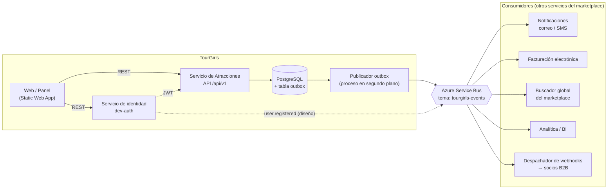
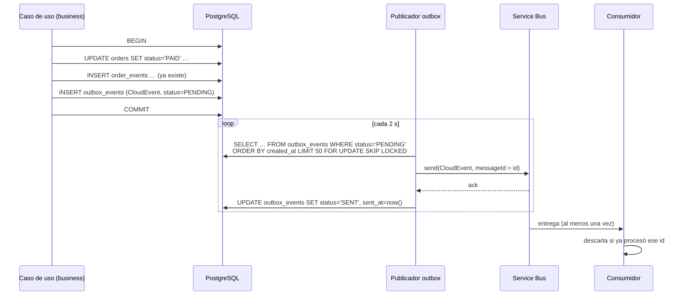

# Diseño de eventos y servicios para integración (SOA/EDA) · TourGirls

Diseño preliminar de la integración **asíncrona** del servicio de atracciones con otros sistemas: qué eventos publica,
con qué formato, por qué canal y cómo se garantiza la entrega. Complementa la integración síncrona por REST descrita
en [INTEROPERABILIDAD.md](INTEROPERABILIDAD.md).

**Estado de cada parte:**

| Parte | Estado |
|---|---|
| Eventos de dominio registrados en tablas (`order_events`, `payment_events`, `inventory_movements`, `audit_events`) | ✅ **Implementado** |
| Historial consultable (`GET /api/v1/orders/{id}/events`, detalle de pedido en `/admin/orders/{id}`) | ✅ **Implementado** |
| Separación en servicios (API de atracciones + servicio de autenticación) | ✅ **Implementado** |
| Catálogo de eventos de integración, formato CloudEvents, AsyncAPI | 📐 **Diseño** (este documento) |
| Outbox transaccional, publicación en Azure Service Bus, webhooks | 📐 **Diseño**, con plan de implementación en §8 |

---

## 1. Vista de servicios (SOA)



| Servicio | Responsabilidad | Interfaz síncrona | Interfaz asíncrona |
|---|---|---|---|
| **Atracciones** (este repositorio) | Catálogo, disponibilidad, reservas, pedidos, pagos simulados, administración | REST `/api/v1` (OpenAPI) | **Produce** los eventos de §3 |
| **Identidad** (dev-auth, sustituible por OIDC) | Cuentas, credenciales, emisión de JWT | `POST /auth/register`, `/auth/login` | **Produce** `user.registered` |
| Notificaciones *(futuro)* | Correos de confirmación, recordatorios, reembolsos | — | **Consume** reservas, pedidos y usuarios |
| Facturación *(futuro)* | Factura y nota de crédito electrónicas | Consulta `GET /orders/{id}` | **Consume** `order.paid`, `order.refunded` |
| Buscador global *(futuro)* | Índice de búsqueda de todo el marketplace | Carga inicial con `GET /atracciones` | **Consume** `attraction.*`, `availability.changed` |
| Pagos *(futuro)* | Pasarela real | Webhook entrante hacia Atracciones | **Produce** el resultado del pago; Atracciones lo traduce a `order.paid` / `payment.failed` |

**Principios:**
- Cada servicio es dueño de sus datos; nadie lee las tablas de otro.
- La integración entre servicios se hace **por eventos** cuando basta con enterarse de algo, y **por REST** cuando se
  necesita una respuesta inmediata.

---

## 2. Lo que ya existe en el código (base del diseño)

Los casos de uso ya registran, **en la misma transacción** que el cambio de negocio, estos registros inmutables:

| Tabla | Tipos registrados hoy | Dónde se escriben |
|---|---|---|
| `order_events` | `ORDER_CREATED`, `PAYMENT_SETTLED`, `ORDER_CANCELLED`, `ORDER_PARTIALLY_REFUNDED`, `ORDER_REFUNDED` (con estado anterior y nuevo) | `OrderWorkflow` en `packages/business/src/services/ecommerce.ts` |
| `payment_events` | `PAYMENT_REQUESTED`, `PAYMENT_AUTHORIZED`, `PAYMENT_SETTLED`, `PAYMENT_REJECTED`, `PAYMENT_FAILED`, `PAYMENT_PARTIALLY_REFUNDED`, `PAYMENT_REFUNDED` (payload `jsonb`) | `OrderWorkflow.processPayment` y `refundOrder` |
| `inventory_movements` | `CONFIRMED`, `RELEASED`, `CANCELLED` (+/− cupos por franja) | Compra, cancelación y reembolso |
| `audit_events` | Cambios administrativos: `availability.*`, `user.*`, `order.cancelled`, `order.refunded`… | `AdminService`, `AttractionService` |

Esos son los **puntos de emisión** del diseño: cada lugar donde hoy se inserta uno de estos registros es donde se
insertará también el evento de integración en la tabla outbox (§6).

---

## 3. Catálogo de eventos de integración

**Convenciones:**
- Nombre `ec.tourgirls.<entidad>.<hecho en pasado>.v<versión>`.
- Los eventos describen **hechos ocurridos**, no órdenes.
- El payload lleva lo necesario para actuar sin llamar de vuelta al API; los datos completos se consultan por REST.

| Tipo (`type`) | Productor | Se emite cuando… | Punto de emisión en el código | Consumidores previstos |
|---|---|---|---|---|
| `ec.tourgirls.attraction.published.v1` | Atracciones | Se crea una atracción | `AttractionService.create` | Buscador global, caché |
| `ec.tourgirls.attraction.updated.v1` | Atracciones | PUT o PATCH de una atracción | `AttractionService.replace` / `patch` | Buscador global |
| `ec.tourgirls.attraction.deleted.v1` | Atracciones | Se elimina una atracción | `AttractionService.delete` | Buscador global |
| `ec.tourgirls.availability.changed.v1` | Atracciones | Cambian los cupos libres de una franja (reserva, cancelación, reembolso total, cambio de capacidad o franja nueva) | `inventory_movements`, `AdminService.updateSlotCapacity` / `addSlot` | Canales de venta, buscador |
| `ec.tourgirls.reservation.confirmed.v1` | Atracciones | Reserva confirmada (directa o al pagar) | `ReservationService.create`, `OrderWorkflow.markPaid` | Notificaciones, operador del tour |
| `ec.tourgirls.reservation.cancelled.v1` | Atracciones | Reserva cancelada (cliente, admin o reembolso total) | `ReservationService.cancel`, `OrderWorkflow.cancelPendingOrder` / `refundOrder` | Notificaciones, operador |
| `ec.tourgirls.order.created.v1` | Atracciones | Pedido pendiente de pago con cupos retenidos | `OrderWorkflow.placePendingOrder` | BI (embudo de conversión) |
| `ec.tourgirls.order.paid.v1` | Atracciones | Pago liquidado; pedido `PAID` | `OrderWorkflow.markPaid` | Facturación, notificaciones, BI |
| `ec.tourgirls.order.cancelled.v1` | Atracciones | Pedido pendiente cancelado | `OrderWorkflow.cancelPendingOrder` | BI |
| `ec.tourgirls.order.refunded.v1` | Atracciones | Reembolso parcial o total (`refundType`) | `OrderWorkflow.refundOrder` | Facturación (nota de crédito), notificaciones |
| `ec.tourgirls.payment.failed.v1` | Atracciones | Intento de pago rechazado o fallido | `OrderWorkflow.processPayment` | Atención al cliente, antifraude |
| `ec.tourgirls.user.registered.v1` | Identidad | Alta de una cuenta | `AccountService.register` (dev-auth) | Notificaciones (bienvenida), CRM |
| `ec.tourgirls.user.status-changed.v1` | Atracciones | Un admin activa, bloquea o desactiva un usuario | `AdminService.setUserStatus` | Identidad (revocar sesiones), CRM |

**Qué no se publica:** contraseñas, tokens, `Idempotency-Key`, datos de tarjeta ni datos de facturación completos
(RUC o dirección). Para facturar se consulta `GET /orders/{id}` con los permisos adecuados.

---

## 4. Formato de mensaje: CloudEvents 1.0

Todos los eventos usan el sobre **CloudEvents 1.0** (JSON, modo estructurado), que tanto Azure Service Bus como Event
Grid entienden:

| Atributo | Valor |
|---|---|
| `specversion` | `"1.0"` |
| `id` | UUID único del evento; los consumidores **descartan duplicados** por este campo |
| `type` | Tipo del catálogo (§3) |
| `source` | `/tourgirls/atracciones` o `/tourgirls/identidad` |
| `subject` | Recurso afectado: `orders/{id}`, `reservations/{id}`, `attractions/{id}`, `availability/{slotId}` |
| `time` | Instante UTC en que ocurrió el hecho (el de la transacción) |
| `datacontenttype` | `application/json` |
| `dataschema` | `https://<api>/schemas/events/<type>.json` (esquema versionado) |
| `traceparent` | *(extensión)* Correlación W3C con el `X-Request-Id` de la solicitud original |
| `data` | Payload propio del tipo (§4.1) |

### 4.1 Ejemplos de payload

`ec.tourgirls.order.paid.v1`

```json
{
  "specversion": "1.0",
  "id": "0b8f6a3e-5d2c-4f61-9a0e-3c1d2b7e9f10",
  "type": "ec.tourgirls.order.paid.v1",
  "source": "/tourgirls/atracciones",
  "subject": "orders/2f0c9d1a-7b3e-4c55-8e21-6a9b0d4f3e12",
  "time": "2026-10-07T15:04:05.123Z",
  "datacontenttype": "application/json",
  "dataschema": "https://tourgirls-api-mms-hagtfccfdddceheu.westus2-01.azurewebsites.net/schemas/events/ec.tourgirls.order.paid.v1.json",
  "data": {
    "orderId": "2f0c9d1a-7b3e-4c55-8e21-6a9b0d4f3e12",
    "customerId": "9d2e4b10-1c3f-4a7e-b5d8-0e6f2a1c3b47",
    "reservationId": "a7c1e5f2-3b9d-4e60-8f14-2d5c7b9a0e31",
    "total": { "currency": "USD", "amount": 50.0 },
    "items": [
      { "attractionId": "a1b2c3d4-0002-4000-8000-000000000002", "serviceDate": "2026-11-02", "serviceTime": "09:00", "quantity": 2, "unitPrice": 25.0 }
    ],
    "payment": { "paymentId": "5e1d…", "method": "CARD", "gatewayReference": "SIM-5E1D2C3B4A59" }
  }
}
```

`ec.tourgirls.order.refunded.v1`

```json
{
  "orderId": "2f0c9d1a-7b3e-4c55-8e21-6a9b0d4f3e12",
  "refundType": "PARTIAL",
  "refundAmount": { "currency": "USD", "amount": 20.0 },
  "refundedTotal": { "currency": "USD", "amount": 20.0 },
  "reason": "Una entrada sin usar",
  "orderStatus": "PARTIALLY_REFUNDED",
  "reservationCancelled": false
}
```

`ec.tourgirls.availability.changed.v1`

```json
{
  "slotId": "c3d9…",
  "attractionId": "a1b2c3d4-0001-4000-8000-000000000001",
  "date": "2026-11-02",
  "time": "09:00",
  "capacity": 20,
  "reserved": 7,
  "available": 13,
  "cause": "RESERVATION"
}
```

`cause` admite `RESERVATION`, `CANCELLATION`, `REFUND`, `CAPACITY_CHANGED` y `SLOT_CREATED`.

`ec.tourgirls.reservation.confirmed.v1`

```json
{
  "reservationId": "a7c1e5f2-3b9d-4e60-8f14-2d5c7b9a0e31",
  "attractionId": "a1b2c3d4-0002-4000-8000-000000000002",
  "attractionName": "Ciudad Mitad del Mundo: visita guiada a la línea ecuatorial",
  "date": "2026-11-02",
  "time": "09:00",
  "ticketCount": 2,
  "customerName": "Ana Pérez",
  "customerEmail": "ana@example.com",
  "orderId": "2f0c9d1a-7b3e-4c55-8e21-6a9b0d4f3e12"
}
```

`orderId` es `null` en una reserva directa sin pago. El correo se incluye porque Notificaciones lo necesita; los
consumidores deben tratarlo como dato personal.

### 4.2 Reglas de evolución

- **Compatible (misma versión):** añadir campos opcionales. Los consumidores deben ignorar los campos desconocidos.
- **Incompatible:** quitar o renombrar campos o cambiar su significado. Requiere un nuevo `type` con `.v2`, y se
  publican **ambas** versiones durante el periodo de transición (mínimo 6 meses, como el API REST).

---

## 5. Webhooks para socios (completa el scope `attractions:webhooks`)

Para socios que no pueden conectarse a Service Bus (agencias u operadores), los mismos eventos se entregan por HTTP.

### 5.1 Gestión de suscripciones (API REST propuesta)

| Método y ruta | Scope | Descripción |
|---|---|---|
| `POST /api/v1/webhooks/subscriptions` | `attractions:webhooks` | Crea una suscripción: `{ url, events: ["ec.tourgirls.reservation.confirmed.v1", …], description }`. Devuelve `id` y un `secret` (solo esta vez) |
| `GET /api/v1/webhooks/subscriptions` | `attractions:webhooks` | Lista las suscripciones del socio |
| `DELETE /api/v1/webhooks/subscriptions/{id}` | `attractions:webhooks` | Elimina una suscripción |
| `POST /api/v1/webhooks/subscriptions/{id}/test` | `attractions:webhooks` | Envía un evento `ec.tourgirls.webhook.ping.v1` de prueba |
| `GET /api/v1/webhooks/subscriptions/{id}/deliveries` | `attractions:webhooks` | Historial de entregas (estado, código HTTP, intentos) |

**Restricciones:**
- Solo URLs `https`.
- Un socio solo recibe eventos de **sus** recursos (sus reservas y pedidos) más los eventos públicos de catálogo y
  disponibilidad.

### 5.2 Entrega

```http
POST https://socio.example.com/tourgirls/webhooks
Content-Type: application/cloudevents+json
X-TourGirls-Event-Id: 0b8f6a3e-5d2c-4f61-9a0e-3c1d2b7e9f10
X-TourGirls-Timestamp: 1791396245
X-TourGirls-Signature: sha256=5f2b…

{ …CloudEvent… }
```

- **Firma:** `HMAC-SHA256(secret, timestamp + "." + body)`. El socio rechaza las firmas inválidas y los timestamps de
  más de 5 minutos (protección contra repetición).
- **Éxito:** cualquier `2xx` en menos de 10 s.
- **Reintentos:** backoff exponencial (1 min, 5 min, 30 min, 2 h, 6 h, 24 h). Tras el último, la entrega pasa a
  `FAILED` y la suscripción se desactiva si falla 3 días seguidos.
- **Duplicados:** puede llegar el mismo evento más de una vez; el socio deduplica por `X-TourGirls-Event-Id`.

---

## 6. Garantía de entrega: patrón Transactional Outbox

**El problema:** si el API guarda el pedido y después publica en Service Bus, una caída entre los dos pasos pierde el
evento o lo publica sin que el cambio se haya guardado.

**La solución:** el evento se guarda en la **misma transacción** que el cambio de negocio, y un proceso aparte lo
publica.



### 6.1 Tabla propuesta

```sql
CREATE TABLE outbox_events (
  id             uuid PRIMARY KEY,                 -- = CloudEvent.id
  type           varchar(120) NOT NULL,
  subject        varchar(200) NOT NULL,
  payload        jsonb        NOT NULL,            -- CloudEvent completo
  status         varchar(20)  NOT NULL DEFAULT 'PENDING'
                 CHECK (status IN ('PENDING', 'SENT', 'FAILED')),
  attempts       int          NOT NULL DEFAULT 0,
  last_error     varchar(500),
  created_at     timestamptz  NOT NULL,
  sent_at        timestamptz
);
CREATE INDEX ix_outbox_pending ON outbox_events (created_at) WHERE status = 'PENDING';
```

**Garantías resultantes:**
- **Al menos una vez:** nunca se pierde un evento confirmado. Puede duplicarse, y por eso los consumidores deduplican
  por `id`.
- **Orden por recurso:** se usa `subject` como `SessionId` de Service Bus, para que los eventos de un mismo pedido
  lleguen en orden.
- **Sin pérdidas ante caídas:** si el broker no responde, el evento queda `PENDING` y se reintenta. Tras N fallos pasa
  a `FAILED` y genera una alerta.
- **Limpieza:** los eventos `SENT` se borran tras 7 días.

### 6.2 Infraestructura en Azure

| Recurso | Uso |
|---|---|
| **Azure Service Bus** (Standard) | Tema `tourgirls-events`; una **suscripción por consumidor** con filtro SQL por `type` (p. ej. `type LIKE 'ec.tourgirls.order.%'`); sesiones por `subject`; cola de mensajes muertos (DLQ) para errores irrecuperables |
| Publicador | Proceso en segundo plano dentro del App Service del API (`setInterval`) o, mejor, una **Azure Function** con disparador de tiempo |
| Despachador de webhooks | Consumidor de Service Bus que lee las suscripciones y hace los POST firmados (§5) |
| Alternativa | **Azure Event Grid** (también entiende CloudEvents) si se prefiere push sin gestionar colas |

---

## 7. Especificación AsyncAPI (borrador)

```yaml
asyncapi: 3.0.0
info:
  title: TourGirls · Eventos del servicio de Atracciones
  version: 1.0.0
  description: >
    Eventos de integración publicados con el formato CloudEvents 1.0 (modo estructurado) en Azure Service Bus.
    Entrega al menos una vez: los consumidores deben deduplicar por el campo `id`.
defaultContentType: application/cloudevents+json

servers:
  produccion:
    host: tourgirls.servicebus.windows.net
    protocol: amqp
    description: Azure Service Bus (Standard). Autenticación con Managed Identity o SAS por consumidor.

channels:
  tourgirlsEvents:
    address: tourgirls-events
    description: Tema único; cada consumidor crea una suscripción filtrada por `type`.
    messages:
      orderPaid: { $ref: '#/components/messages/OrderPaid' }
      orderRefunded: { $ref: '#/components/messages/OrderRefunded' }
      reservationConfirmed: { $ref: '#/components/messages/ReservationConfirmed' }
      reservationCancelled: { $ref: '#/components/messages/ReservationCancelled' }
      availabilityChanged: { $ref: '#/components/messages/AvailabilityChanged' }
      attractionPublished: { $ref: '#/components/messages/AttractionPublished' }

operations:
  publishEvents:
    action: send
    channel: { $ref: '#/channels/tourgirlsEvents' }
    summary: El servicio de Atracciones publica sus eventos de dominio.

components:
  schemas:
    CloudEvent:
      type: object
      required: [specversion, id, type, source, time, data]
      properties:
        specversion: { type: string, const: '1.0' }
        id: { type: string, format: uuid }
        type: { type: string }
        source: { type: string }
        subject: { type: string }
        time: { type: string, format: date-time }
        datacontenttype: { type: string, const: application/json }
        dataschema: { type: string, format: uri }
        traceparent: { type: string }
    Money:
      type: object
      required: [currency, amount]
      properties:
        currency: { type: string, pattern: '^[A-Z]{3}$' }
        amount: { type: number, minimum: 0 }
    OrderPaidData:
      type: object
      required: [orderId, customerId, total, items]
      properties:
        orderId: { type: string, format: uuid }
        customerId: { type: string, format: uuid }
        reservationId: { type: [string, 'null'], format: uuid }
        total: { $ref: '#/components/schemas/Money' }
        items:
          type: array
          items:
            type: object
            required: [attractionId, serviceDate, serviceTime, quantity, unitPrice]
            properties:
              attractionId: { type: string, format: uuid }
              serviceDate: { type: string, format: date }
              serviceTime: { type: string, pattern: '^([01]\d|2[0-3]):[0-5]\d$' }
              quantity: { type: integer, minimum: 1 }
              unitPrice: { type: number }
    OrderRefundedData:
      type: object
      required: [orderId, refundType, refundAmount, refundedTotal, orderStatus]
      properties:
        orderId: { type: string, format: uuid }
        refundType: { type: string, enum: [PARTIAL, FULL] }
        refundAmount: { $ref: '#/components/schemas/Money' }
        refundedTotal: { $ref: '#/components/schemas/Money' }
        reason: { type: string, maxLength: 500 }
        orderStatus: { type: string, enum: [PARTIALLY_REFUNDED, REFUNDED] }
        reservationCancelled: { type: boolean }
    ReservationData:
      type: object
      required: [reservationId, attractionId, date, time, ticketCount]
      properties:
        reservationId: { type: string, format: uuid }
        attractionId: { type: string, format: uuid }
        attractionName: { type: string }
        date: { type: string, format: date }
        time: { type: string }
        ticketCount: { type: integer, minimum: 1 }
        customerName: { type: string }
        customerEmail: { type: string, format: email }
        orderId: { type: [string, 'null'], format: uuid }
        reason: { type: string, description: Solo en reservation.cancelled }
    AvailabilityChangedData:
      type: object
      required: [slotId, attractionId, date, time, capacity, reserved, available, cause]
      properties:
        slotId: { type: string, format: uuid }
        attractionId: { type: string, format: uuid }
        date: { type: string, format: date }
        time: { type: string }
        capacity: { type: integer, minimum: 0 }
        reserved: { type: integer, minimum: 0 }
        available: { type: integer, minimum: 0 }
        cause: { type: string, enum: [RESERVATION, CANCELLATION, REFUND, CAPACITY_CHANGED, SLOT_CREATED] }
    AttractionData:
      type: object
      required: [attractionId, name, productType, price]
      properties:
        attractionId: { type: string, format: uuid }
        name: { type: string }
        productType: { type: string, enum: [SINGLE_TICKET, GUIDED_TOUR, PACKAGE] }
        price: { $ref: '#/components/schemas/Money' }
        cities: { type: array, items: { type: string } }
  messages:
    OrderPaid:
      name: ec.tourgirls.order.paid.v1
      payload:
        allOf:
          - $ref: '#/components/schemas/CloudEvent'
          - properties: { data: { $ref: '#/components/schemas/OrderPaidData' } }
    OrderRefunded:
      name: ec.tourgirls.order.refunded.v1
      payload:
        allOf:
          - $ref: '#/components/schemas/CloudEvent'
          - properties: { data: { $ref: '#/components/schemas/OrderRefundedData' } }
    ReservationConfirmed:
      name: ec.tourgirls.reservation.confirmed.v1
      payload:
        allOf:
          - $ref: '#/components/schemas/CloudEvent'
          - properties: { data: { $ref: '#/components/schemas/ReservationData' } }
    ReservationCancelled:
      name: ec.tourgirls.reservation.cancelled.v1
      payload:
        allOf:
          - $ref: '#/components/schemas/CloudEvent'
          - properties: { data: { $ref: '#/components/schemas/ReservationData' } }
    AvailabilityChanged:
      name: ec.tourgirls.availability.changed.v1
      payload:
        allOf:
          - $ref: '#/components/schemas/CloudEvent'
          - properties: { data: { $ref: '#/components/schemas/AvailabilityChangedData' } }
    AttractionPublished:
      name: ec.tourgirls.attraction.published.v1
      payload:
        allOf:
          - $ref: '#/components/schemas/CloudEvent'
          - properties: { data: { $ref: '#/components/schemas/AttractionData' } }
```

El resto de tipos del catálogo (§3) siguen el mismo patrón. Para validar el borrador, copiar el bloque en un archivo
`asyncapi.yaml` y abrirlo en AsyncAPI Studio.

---

## 8. Plan de implementación (cuando se aborde)

| Fase | Trabajo | Capa afectada |
|---|---|---|
| 1 | Migración `outbox_events` y método `OutboxRepository.add(event)` en la unidad de trabajo | `data-management`, `data-access` |
| 2 | Generar el CloudEvent en los puntos de emisión de §3, en la misma transacción. Empezar por `order.paid`, `order.refunded`, `reservation.confirmed` y `reservation.cancelled` | `business` |
| 3 | Publicador: Azure Function con disparador de tiempo que lee `PENDING` con `FOR UPDATE SKIP LOCKED` y envía a Service Bus | nuevo `apps/outbox-publisher` |
| 4 | Servir los esquemas `GET /schemas/events/{type}.json` y el `asyncapi.yaml` | `apps/api` |
| 5 | Webhooks: tablas `webhook_subscriptions` y `webhook_deliveries`, endpoints de §5.1 y despachador consumidor de Service Bus | `apps/api`, nuevo `apps/webhook-dispatcher` |
| 6 | dev-auth publica `user.registered` (o se delega en el proveedor OIDC) | `apps/auth` |
| 7 | Observabilidad: métricas de eventos pendientes o fallidos, alertas por DLQ y `traceparent` de extremo a extremo | Transversal |

**Pruebas previstas:**
- un evento por cambio (sin perder ni duplicar si la transacción se revierte);
- reenvío tras la caída del broker;
- deduplicación en los consumidores;
- verificación de la firma de los webhooks.
